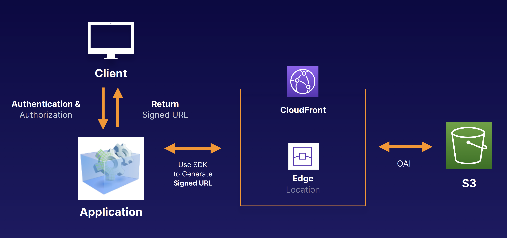

## CloudFront Signed URLs and Cookies

### Restricting Content Access
Premium streaming services like netflix, online learning course etc...

### Use CloudFront Signed URLS or Signed Cookies
- A signed URL is for individual files, 1 file = 1 URL.
- A signed cookie is for multiple files, 1 cookie = multiple files.

### Signed URL Policies
When we create a signed URL or signed cookie, we attach a policy. The policy can include:
- URL expiration
- IP ranges
- Trusted signers (which AWS accounts can create signed URLS)

### How Signed URLs Work

### Other notes:
Cloudfront Signed URLs
- Can have different origins. Does not have to be EC2.
- Key–pair is account wide and managed by the root user
- Can utilize caching features
- Can filter by date, path, IP address, expiration, etc.

S3 signed URLs
- Issues a request as the IAM user who creates the presigned URL
- Limited lifetime

### Exam Tips
- Use signed URLs/cookies when you want to secure content so that only the people you authorize are able to access it.
- A signed URL is for individual files. 1 file = 1 URL.
- A signed cookie is for multiple files. 1 cookie = multiple files.
- If your origin is EC2, then use CloudFront.
- https://tutorialsdojo.com/s3-pre-signed-urls-vs-cloudfront-signed-urls-vs-origin-access-identity-oai/