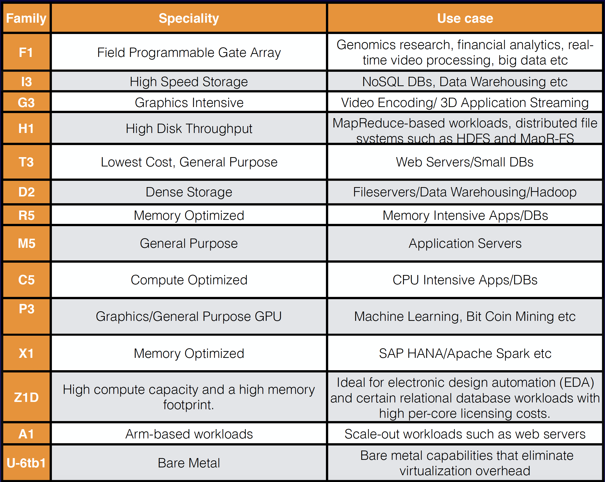

## EC2 101

Amazon Elastic Compute Cloud (Amazon EC2) is a web service that provides resizable compute capacity in the cloud. Amazon EC2 reduces the time required to obtain and boot new server instances to minutes, allowing you to quickly scale capacity, both up and down, as your computing requirements change.

### EC2 Pricing Models
- **On Demand**: Allows you to pay a fixed rate by the hour (or by the second) with no commitment.
- **Reserved**: Provides you with a capacity reservation, and offer a significant discount on the hourly charge for an instance. Contract Terms are 1 Year or 3 Year Terms.
- **Spot**: Enables you to bid whatever price you want for instance capacity, providing for even greater savings if your applications have flexible start and end times.
- **Dedicated Hosts** Physical EC2 server dedicated for your use. Dedicated Hosts can help you reduce costs by allowing you to use your existing server-bound software licenses.

On Demand pricing is useful for:
- Users that want the low cost and flexibility of Amazon EC2 without any up-front payment or long-term commitment
- Applications with short term, spiky, or unpredictable workloads that cannot be interrupted
- Applications being developed or tested on Amazon EC2 for the first time

Reserved pricing is useful for:
- Applications with steady state or predictable usage
- Applications that require reserved capacity
- Users able to make upfront payments to reduce their total computing costs even further

Reserved Pricing Types:
- Standard Reserved instances: These offer up to 75% off on demand instances. The more you pay up front and the longer the contract, the greater the discount.
- Convertible Reserved Instances: These offer up to 54% off on demand capability to change the attributes of the RI as long as the exchange results in the creation of Reserved Instances of equal or greater value.
- Scheduled Reserved Instances: These are available to launch within the time windows you reserve. This option allows you to match your capacity reservation to a predictable recurring schedule that only requires a fraction of a day, a week, or a month.

Spot pricing is useful for:
- Applications that have flexible start and end times
- Applications that are only feasible at very low compute prices
- Users with urgent computing needs for large amounts of additional capacity

Dedicated Hosts pricing is useful for
- Useful for regulatory requirements that may not support multi-tenant virtualization.
- Great for licensing which does not support multi-tenancy or cloud deployments.
- Can be purchased On-Demand (hourly.)
- Can be purchased as a Reservation for up to 70% off the On-Demand price

### EC2 Instance types:

- F - For FPGA
- I - For IOPS
- G - Graphics
- H - High Disk Throughput
- T - Cheap general purpose (think T2 Micro)
- D - For Density
- R - For RAM
- M - Main choice for general purpose apps
- C - For Compute
- P - Graphics (think Pics)
- X - Extreme Memory
- Z - Extreme Memory AND CPU
- A - Arm-based workloads
- U - Bare Metal

### Other notes:
- Termination Protection is turned off by default, you must turn it on.
- On an EBS-backed instance, the default action is for the root EBS volume to be deleted when the instance is terminated.
- EBS Root Volumes of your DEFAULT AMI’s CAN be encrypted. You can also use a third party tool (such as bit locker etc) to encrypt the root volume, or this can be done when creating AMI’s in the AWS console or using the API.
- Additional volumes can be encrypted.

