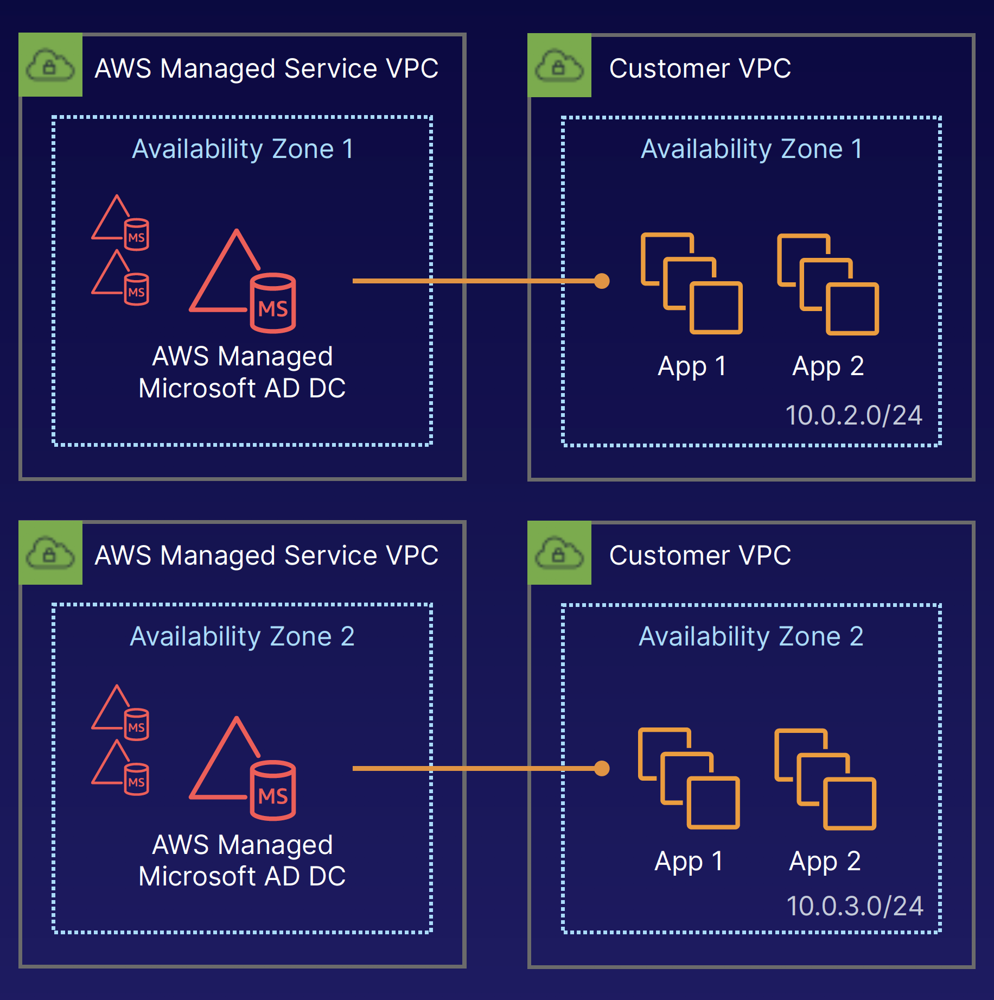

## AWS Directory Service

### What Is AWS Directory Service
- Family of managed services
- Connect AWS resources with on-premises AD
- Standalone directory in the cloud
- Use existing corporate credentials
- SSO to any domain-joined EC2 instance

### What Is Active Directory
- On-premises directory service
- Hierarchical database of users, groups, computers — trees and forests
- Group policies
- LDAP and DNS
- Kerberos, LDAP, and NTLM authentication
- Highly available

### AWS Managed Microsoft AD
- AD domain controllers (DCs) running Windows Server
- Reachable by applications in your VPC
- Add DCs for HA and performance
- Exclusive access to DCs
- Extend existing AD to on-premises using AD Trust

AWS:
- Multi-AZ deployment
- Patch, monitor, recover
- Instance rotation
- Snapshot and restore

Customer:
- Users, groups, GPOs
- Standard AD tools
- Scale out DCs
- Trusts (resource forest)
- Certificate authorities (LDAPS)
- Federation

### Simple AD
- Standalone managed directory
- Basic AD features
- Small: <= 500; Large <= 5,000 users
- Easier to manage EC2
- Linux workloads that need LDAP
- Does not support trusts (can’t join on-premises AD)

### AD Connector
- Directory gateway (proxy) for on-premises AD
- Avoid caching information in the cloud
- Allow on-premises users to log in to AWS using AD
- Join EC2 instances to your existing AD domain
- Scale across multiple AD Connectors

### Cloud Directory
- Directory-based store for developers
- Multiple hierarchies with hundreds of millions of objects
- Use cases: org charts, course catalogs, device registries
- Fully managed service

### Amazon Cognito User Pools
- Managed user directory for SaaS applications
- Sign-up and sign-in for web or mobile
- Works with social media identities

### AD Compatible
- Managed Microsoft AD (a.k.a., Directory Service for Microsoft Active Directory)
- AD Connector
- Simple AD

### NOT AD compatible
- Cloud Directory
- Cognito user pools