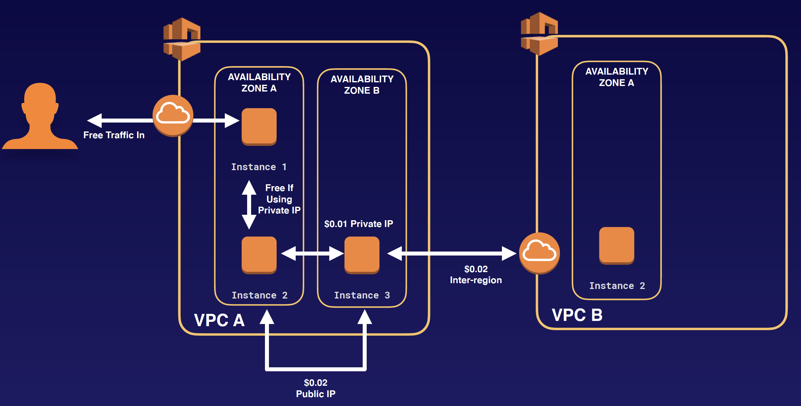

## AWS Network Cost

- Use private IP addresses over public IP addresses to save on costs. This then utilizes the AWS backbone network.
- If you want to cut all network costs, group your EC2 instances in the same Availability Zone and use private IP addresses. This will be cost-free, but make sure to keep in mind single point of failure issues.

