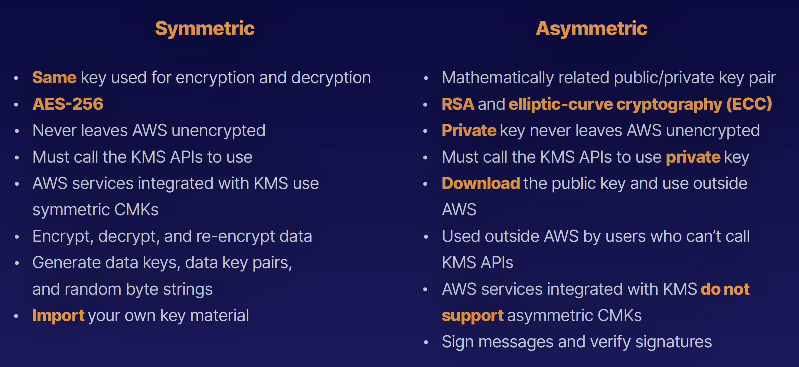

## Key Management Service

- Regional secure key management and encryption and decryption
- Manages customer master keys (CMKs)
- Ideal for S3 objects, database passwords and API keys stored in Systems Manager Parameter Store
- Encrypt and decrypt data up to 4 KB in size
- Integrated with most AWS services
- Pay per API call
- Audit capability using CloudTrail — logs delivered to S3
- FIPS 140-2 Level 2
- Level 3 is CloudHSM

### Types of CMKs
- AWS Managed CMK:  Free; used by default if you pick encryption in most AWS services. Only that service can use them directly.
- Customer Managed CMK: Allows key rotation; controlled via key policies and can be enabled/disabled.
- AWS Owned CMK Used by AWS on a shared basis across many accounts; you typically won’t see these.

### Symetric vs Asymetric

