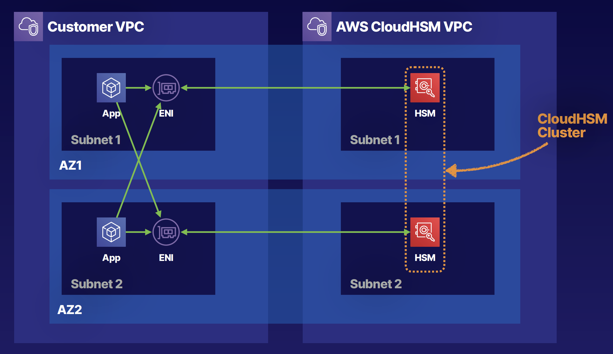

## Cloud HSM

- Dedicated hardware security module (HSM)
- FIPS 140-2 Level 3, Level 2 is KMS
- Manage your own keys
- No access to the AWS-managed component
- Runs within a VPC in your account
- Single tenant, dedicated hardware, multi-AZ cluster
- Industry-standard APIs — no AWS APIs
- PKCS#11
- Java Cryptography Extensions (JCE)
- Microsoft CryptoNG (CNG)
- Keep your keys safe — irretrievable if lost!

