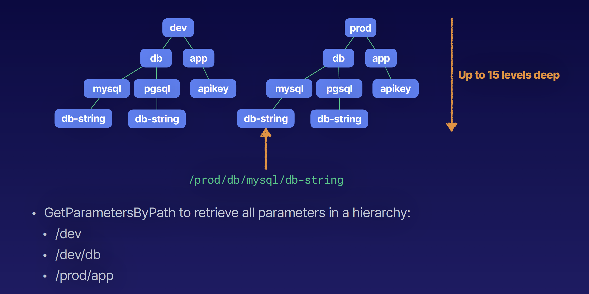

## System Manager Parameter Store

### What Is Parameter Store
Systems Manager Parameter Store provides a centralized store to manage your configuration data, whether it's plain-text data (e.g., database strings) or secrets (e.g., passwords). This allows you to separate your secrets and configuration data from your code. Parameters can be tagged and organized into hierarchies, helping you manage parameters more easily.

- Component of AWS Systems Manager (SSM)
- Secure serverless storage for configuration and secrets:
  - Passwords
  - Database connection strings
  - License codes
  - API keys
- Values can be stored encrypted (KMS or plaintext
- Separate data from source control
- Store parameters in hierarchies
- Track versions
- Set TTL to expire values such as passwords

### Organizing Parameters into Hierarchies

