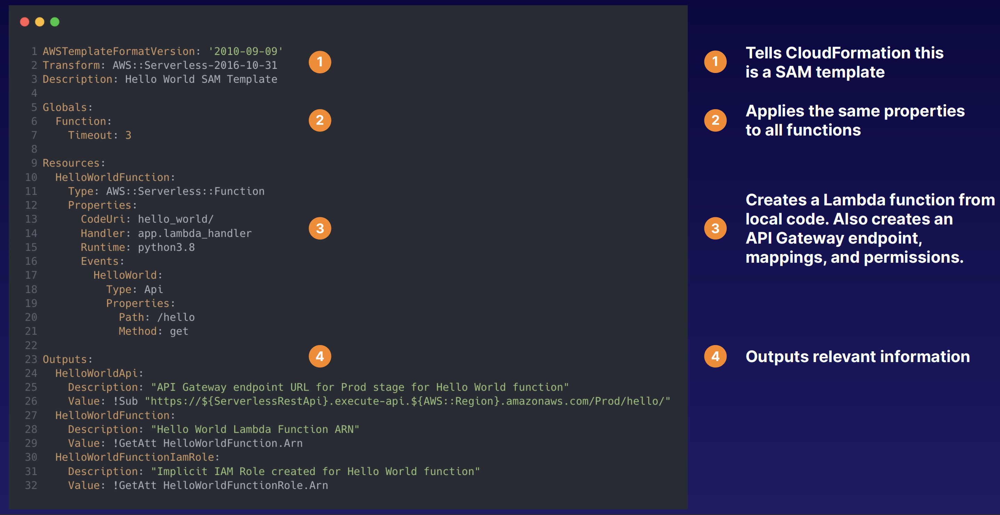
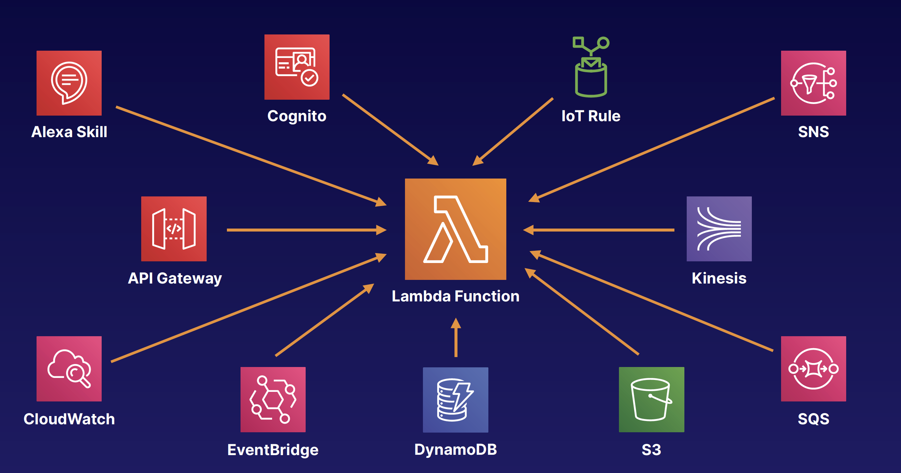

## Serverless Application Model
- CloudFormation extension optimized for serverless applications
- New types: functions, APIs, tables
- Supports anything CloudFormation supports
- Run serverless applications locally
- Package and deploy using CodeDeploy

### Anatomy of a SAM Template

### Lambda Function Event Source
