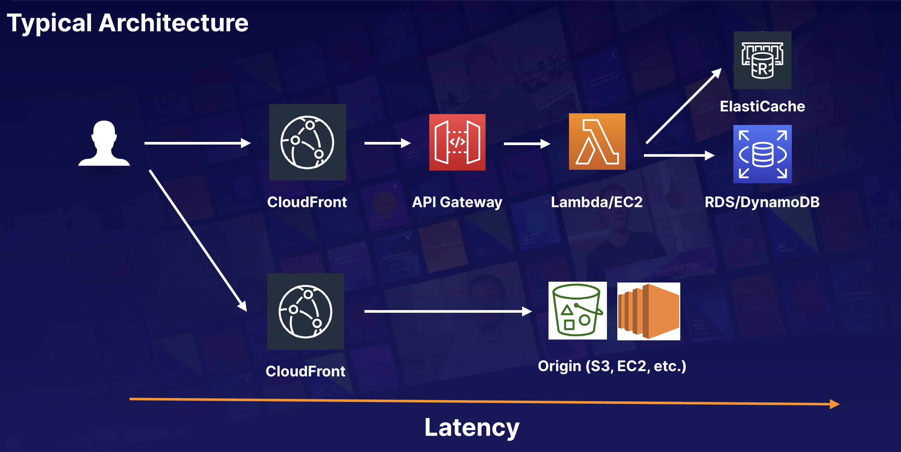

## Caching Strategies on AWS

The following services have caching capabilities:
- CloudFront
- API Gateway
- ElastiCache — Memcached and Redis
- DynamoDB Accelerator (DAX)

### Exam Tips
Caching is a balancing act between up-to-date, accurate information and latency. We can use the following services to cache on AWS:
- CloudFront
- API Gateway
- ElastiCache — Memcached and Redis
- DynamoDB 4 Accelerator (DAX