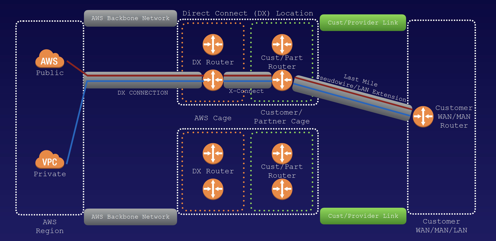

## Direct Connect

AWS Direct Connect is a cloud service solution that makes it easy to establish a dedicated network connection from your premises to AWS. Using AWS Direct Connect, you can establish private connectivity between AWS and your datacenter, office, or colocation environment, which in many cases can reduce your network costs, increase bandwidth throughput, and provide a more consistent network experience than Internet-based connections.

- Direct Connect directly connects your data center to AWS
- Useful for high throughput workloads (ie lots of network traffic)
- Or if you need a stable and reliable secure connection.

### Steps to setting up Direct Connect
- Create a virtual interface in the Direct Connect console. This is a PUBLIC Virtual Interface.
- Go to the VPC console and then to VPN connections. Create a Customer Gateway.
- Create a Virtual Private Gateway
- Attach the Virtual Private Gateway to the desired VPC.
- Select VPN Connections and create new VPN Connection.
- Select the Virtual Private Gateway and the Customer Gateway
- Once the VPN is available, set up the VPN on the customer gateway or firewall.