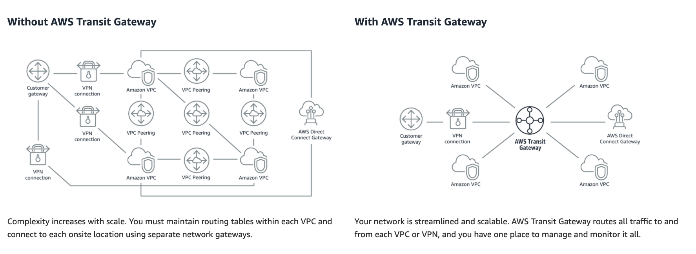

## AWS Transit Gateway

- Allows you to have transitive peering between thousands of VPCs and on-premises data centers.
- Works on a hub-and-spoke model.
- Works on a regional basis, but you can have it across multiple regions.
- You can use it across multiple AWS accounts using RAM (Resource Access Manager).
- You can use route tables to limit how VPCs talk to one another.
- Works with Direct Connect as well as VPN connections.
- Supports IP multicast (not supported by any other AWS service).