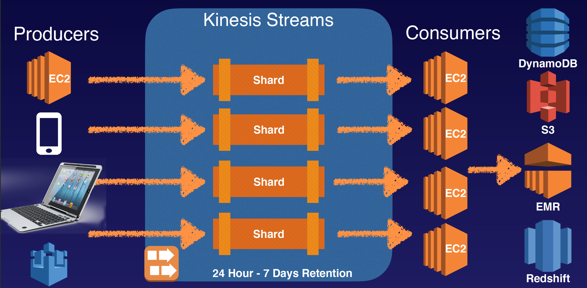
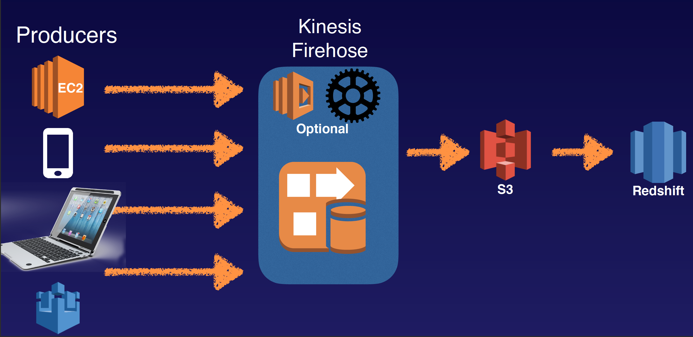
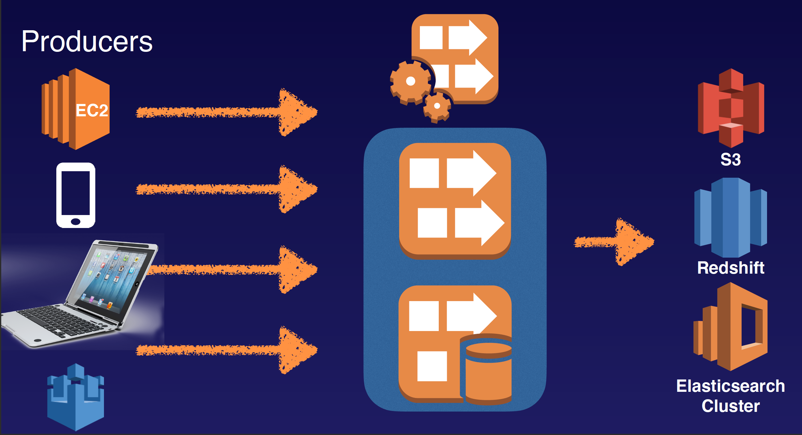

## Kinesis 101

Streaming Data is data that is generated continuously by thousands of data sources, which typically send in the data records simultaneously, and in small sizes (order of Kilobytes.)
- Purchases from online stores (think amazon.com)
- Stock Prices
- Game data (as the gamer plays)
- Social network data
- Geospatial data (think uber.com)
- iOT sensor data

Amazon Kinesis is a platform on AWS to send your streaming data to. Kinesis makes it easy to load and analyze streaming data, and also providing the ability for you to build your own custom applications for you business needs.

3 Different Types of Kinesis:
- Kinesis Streams
- Kinesis Firehose
- Kinesis Analytics

### Kinesis Streams Consist Of Shards:
- 5 transactions per second for reads, up to a maximum total data read rate of 2 MB per second and up to 1,000 records per second for writes, up to a maximum total data write rate of 1 MB per second (including partition keys.)
- The data capacity of your stream is a function of the number of shards that you specify for the stream. The total capacity of the stream is the sum of the capacities of its shards.

### Kinesis Firehorse S3, Redshift, Elastic Search Cluster
Inside KF, there are no persistent storage, data is directly analyze by lamda or other services. The output can store in S3 (directly) Elastic Search Cluster (directy) Redshift (require S3 in the middle)

### Kinesis Analytic
Analyze Data on-the-fly, directly inside Kinesis

