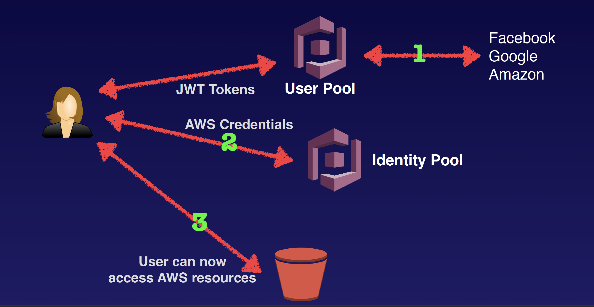

## Web Identity Federation and Cognito

Web Identity Federation lets you give your users access to AWS resources after they have successfully authenticated with a web-based identity provider like Amazon, Facebook, or Google. Following successful authentication, the user receives an authentication code from the Web ID provider, which they can trade for temporary AWS security credentials.

Amazon Cognito provides Web Identity Federation with the following features:
- Sign-up and sign-in to your apps
- Access for guest users
- Acts as an Identity Broker between your application and Web ID providers, so you don’t need to write any additional code.
- Synchronizes user data for multiple devices
- Recommended for all mobile applications that call AWS services.

The recommended approach for Web Identity Federation using social media accounts like Facebook. Cognito brokers between the app and Facebook or Google to provide temporary credentials which map to an IAM role allowing access to the required resources. No need for the application to embed or store AWS credentials locally on the device and it gives users a seamless experience across all mobile devices.

### Cognito User Pools
User Pools are user directories used to manage sign-up and sign-in functionality for mobile and web applications. Users can sign-in directly to the User Pool, or using Facebook, Amazon, or Google. Cognito acts as an Identity Broker between the identity provider and AWS. Successful authentication generates a JSON Web token (JWTs).

### Cognito Identity Pools
Identity Pools enable provide temporary AWS credentials to access AWS services like S3 or DynamoDB.

### Cognito in Action

### Cognito Synchronisation
Cognito tracks the association between user identity and the various different devices they sign-in from. In order to provide a seamless user experience for your application, Cognito uses Push Synchronization to push updates and synchronize user data across multiple devices. Cognito uses SNS to send a notification to all the devices associated with a given user identity whenever data stored in the cloud changes.

### Cognito Exam Tips
- Federation allows users to authenticate with a Web Identity Provider (Google, Facebook, Amazon)
- The user authenticates first with the Web ID Provider and receives an authentication token, which is exchanged for temporary AWS credentials allowing them to assume an IAM role.
- Cognito is an Identity Broker which handles interaction between your applications and the Web ID provider (You don’t need to write your own code to do this.)
- User pool is user based. It handles things like user registration, authentication, and account recovery.
- Identity pools authorise access to your AWS resources.