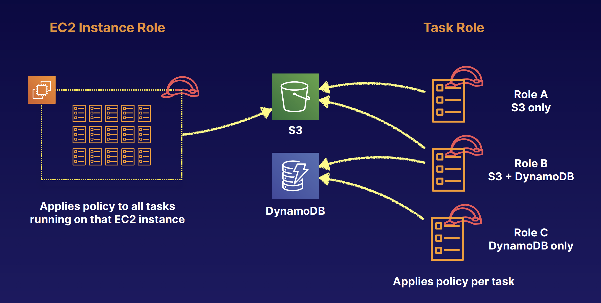

## Elastic Container Service

### What Are Containers and Docker
- A container is a package that contains an application, libraries, runtime, and tools required to run it
- Run on a container engine like Docker
- Provides the isolation benefits of virtualization with less overhead and faster starts than VMs
- Containerized applications are portable and offer a consistent environment

### What Is ECS
- Managed container **orchestration service**
- Create clusters to manage fleets of container deployments
- ECS manages EC2 or Fargate instances (Deploy container into it)
- Schedules containers for optimal placement
- Defines rules for CPU and memory requirements
- Monitors resource utilization
- Deploy, update, roll back
- FREE … for real!
- VPC, security groups, EBS volumes
- ELB
- CloudTrail and CloudWatch

### ECS Components
- **Cluster**: Logical collection of ECS resources — either ECS EC2 instances or Fargate instances
- **Task**: Single running copy of any containers defined by a task definition. One working copy of an application (e.g., DB and web containers).
- **Task Definition**: Defines your application. Similar to a Dockerfile but for running containers in ECS. Can contain multiple containers.
- **Service**: Allows task definitions to be scaled by adding tasks. Defines minimum and maximum values.
- **Container Definition**: Inside a task definition, it defines the individual containers a task uses. Controls CPU and memory allocation and port mappings.
- **Registry**: Storage for container images (e.g., Elastic Container Registry (ECR) or Docker Hub). Used to download images to create containers.

### Fargate
- Serverless container engine
- Eliminates need to provision and manage servers
- Specify and pay for resources per application
- Works with both ECS and EKS
- Each workload runs in its own kernel
- Isolation and security
- Choose EC2 instead if:
  - Compliance requirements
  - Require broader customization
  - Require GPUs

### EKS
- Elastic Kubernetes Service
- K8s is open-source software that lets you deploy and manage containerized applications at scale
- Same toolset on-premises and in cloud
- Containers are grouped in pods
- Like ECS, supports both EC2 and Fargate
- Why use EKS?
  - Already using K8s
  - Want to migrate to AWS

### ECR
- Managed Docker container registry
- Store, manage, and deploy images
- Integrated with ECS and EKS
- Works with on-premises deployments
- Highly available
- Integrated with IAM
- Pay for storage and data transfer

### ECS + ELB
- Distribute traffic evenly across tasks in your service
- Supports ALB, NLB, CLB
- Use ALB to route HTTP/HTTPS (layer 7 traffic
- Use NLB or CLB to route TCP (layer 4 traffic
- Supported by both EC2 and Fargate launch types
- ALB allows:
  - Dynamic host port mapping
  - Path-based routing
  - Priority rules
- ALB is recommended over NLB or CLB

### ECS Security

