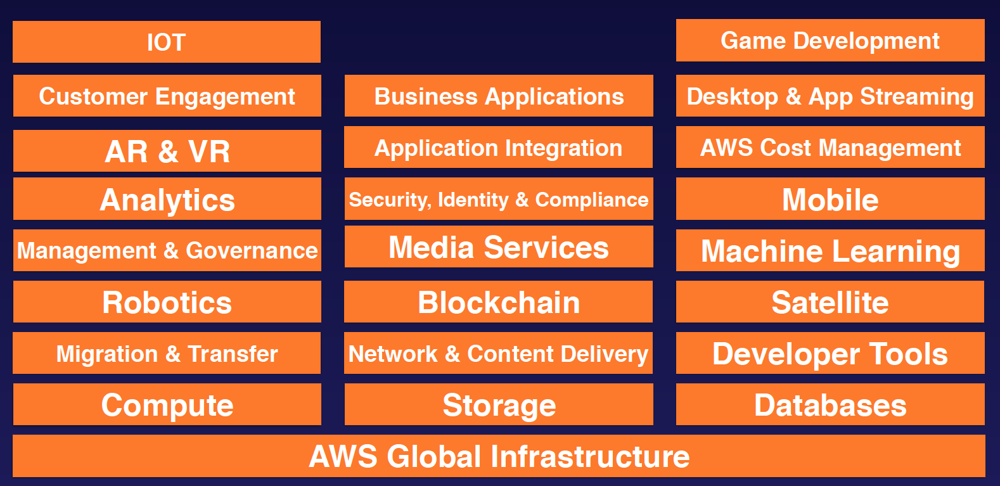
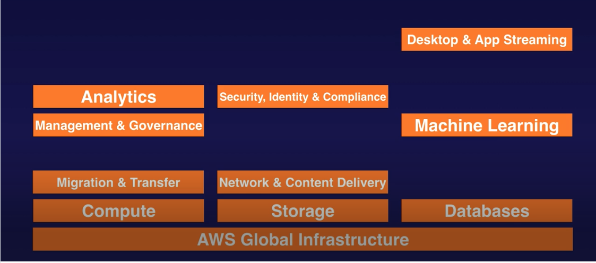

## AWS - 10,000-Foot Overview
### AWS - High Level Services

### AWS Global Infrastructure
- 19 Regions & 57 Availability Zones - December 2018
- 5 More Regions & 15 More AZ's for 2019
- Think of an Availability Zone As A Data Center
  - A Data Center is just a building filled with Servers
  - An Availability Zone may be several data centres, but because they are close together, they are counted as 1 Availability Zone.
- A Region is a geographical area. Each Region consists of 2 (or more) Availability Zones.
- Edge Locations are endpoints for AWS which are used for caching content. Typically this consists of CloudFront, Amazon’s Content Delivery Network (CDN)
  - There are many more Edge Locations than Regions. Currently there are over 150 Edge Locations.

### What do I need to FOCUS on to pass my Solutions Architect Associate Exam (You don't need to cover every single service):

### Exam Tips
- Understand the difference between a region, an Availability Zone (AZ) and an Edge Location.
  - A Region is a physical location in the world which consists of two or more Availability Zones (AZ’s).
  - An AZ is one or more discrete data centers, each with redundant power, networking and connectivity, housed in separate facilities
  - Edge Locations are endpoints for AWS which are used for caching content. Typically this consists of CloudFront, Amazon’s Content Delivery Network (CDN)

### AWS Sign-up
https://portal.aws.amazon.com/billing/signup?nc2=h_ct&src=default&redirect_url=https%3A%2F%2Faws.amazon.com%2Fregistration-confirmation#/start