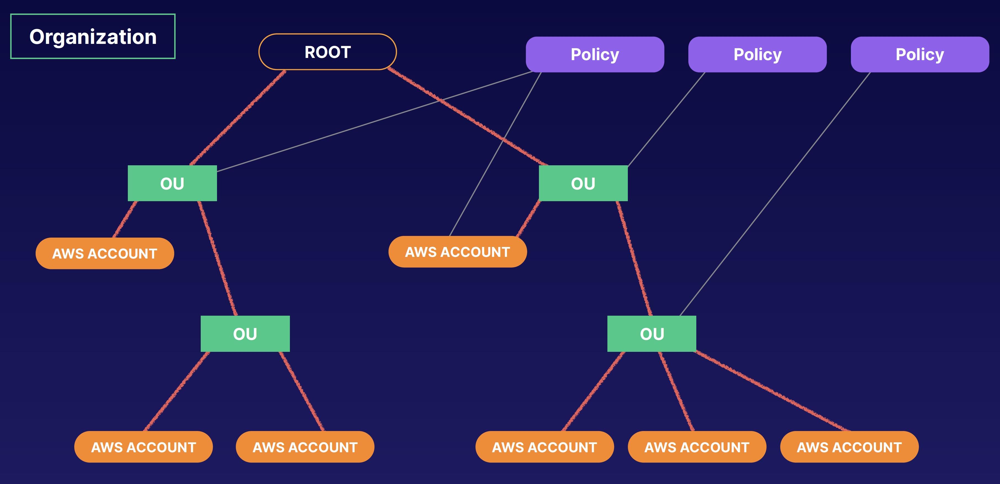
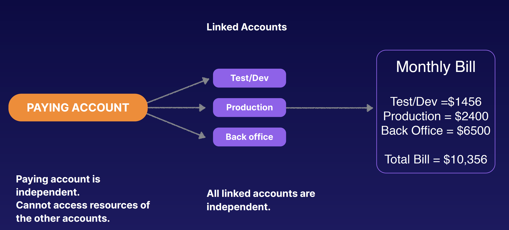

## AWS Organizations and Consolidated Billing

### What is AWS Organizations
- AWS Organizations is an account management service that enables you to consolidate multiple AWS accounts into an organization that you create and centrally manage.

### Consolidated Billing
Advantages of Consolidated Billing:
- One bill per AWS account
- Very easy to track charges and allocate costs
- Volume pricing discount

### Exam Tips:
- Some Best Practices With AWS Organizations
  - Always enable multi-factor authentication on root account.
  - Always use a strong and complex password on root account.
  - Paying account should be used for billing purposes only. Do not deploy resources into the paying account.
  - Enable/Disable AWS services using Service Control Policies (SCP) either on OU or on individual accounts.