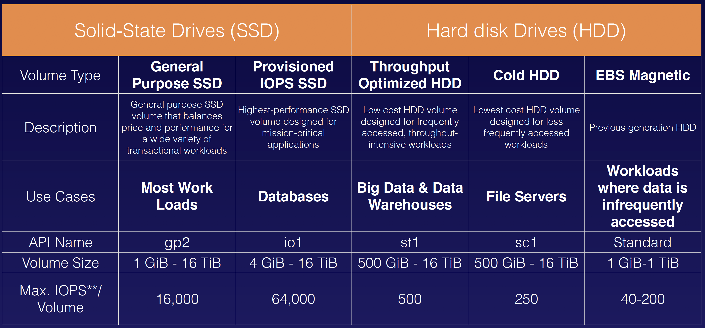

## EBS 101

### What Is EBS
Amazon Elastic Block Store (EBS) provides persistent block storage volumes for use with Amazon EC2 instances in the AWS Cloud. Each Amazon EBS volume is automatically replicated within its Availability Zone to protect you from component failure, offering high availability and durability.

### 5 Different Types of EBS Storage
- General Purpose (SSD)
- Provisioned IOPS (SSD)
- Throughput Optimised Hard Disk Drive
- Cold Hard Disk Drive
- Magnetic

### Compare EBS Types

### Exam Tips
- Volumes exist on EBS. Think of EBS as a virtual hard disk
- Snapshots exist on S3. Think of snapshots as a photograph of the disk.
- Snapshots are point in time copies of Volumes.
- Snapshots are incremental — this means that only the blocks that have changed since your last snapshot are moved to S3.
- If this is your first snapshot, it may take some time to create.
- To create a snapshot for Amazon EBS volumes that serve as root devices, you should stop the instance before taking the snapshot. However you can take a snap while the instance is running.
- You can create AMI’s from Snapshots
- You can change EBS volume sizes on the fly, including changing the size and storage type.
- Volumes will ALWAYS be in the same availability zone as the EC2 instance.
- To move an EC2 volume from one AZ to another, take a snapshot of it, create an AMI from the snapshot and then use the AMI to launch the EC2 instance in a new AZ.
- To move an EC2 volume from one region to another, take a snapshot of it, create an AMI from the snapshot and then copy the AMI from one region to the other. Then use the copied AMI to launch the new EC2 instance in the new region.
- Snapshots of encrypted volumes are encrypted automatically.
- Volumes restored from encrypted snapshots are encrypted automatically.
- You can share snapshots, but only if they are unencrypted.
- These snapshots can be shared with other AWS accounts or made public.