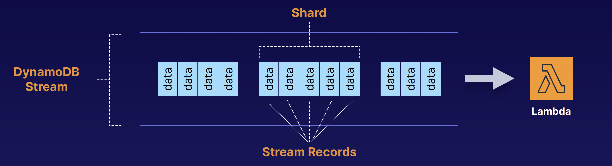
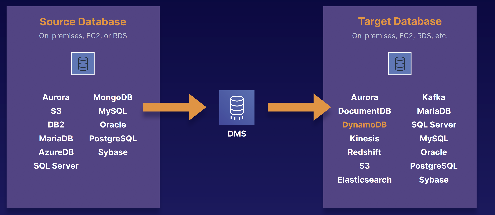

## Advanced DynamoDB

### DynamoDB Accelerator (DAX)
DAX
- Fully managed, highly available, in-memory cache
- 10x performance improvement
- Reduces request time from milliseconds to microseconds — even under load
- No need for developers to manage caching logic (with traditional cache, developer need to configure cache in application, but with DAX, Developer just use DAX directly without any caching configuration - Write throught cache, so Read and Wrire Performance both improved)
- Compatible with DynamoDB API calls

Transactions:
- Multiple “all-or-nothing” operations
- Financial transactions
- Fulfilling orders
- Two underlying reads or writes — prepare/commit
- Up to 25 items or 4 MB of data

On-Demand Capacity
- Pay-per-request pricing
- Balance cost and performance
- No minimum capacity
- No charge for read/write — only storage and backups
- Pay more per request than with provisioned capacity
- Use for new product launches

On-Demand Backup and Restore
- Full backups at any time
- Zero impact on table performance or availability
- Consistent within seconds and retained until deleted
- Operates within same region as the source table

Point-in-Time Recovery (PITR)
- Protects against accidental writes or deletes
- Restore to any point in the last 35 days
- Incremental backups
- Not enabled by default
- Latest restorable: five minutes in the past

Stream
- Time-ordered sequence of item-level changes in a table

- Stored for 24 hours
- Inserts, updates, and deletes
- Combine with Lambda functions for functionality like stored procedures data

Global Table: Managed Multi-Master, Multi-Region Replication
- Globally distributed applications
- Based on DynamoDB streams
- Multi-region redundancy for DR or HA
- No application rewrites
- Replication latency under one second

Database Migration Service (DMS) (Source database remains operational)

Security
- Encryption at rest using KMS
- Site-to-site VPN
- Direct Connect (DX)
- IAM policies and roles
- Fine-grained access
- CloudWatch and CloudTrail
- VPC endpoints
