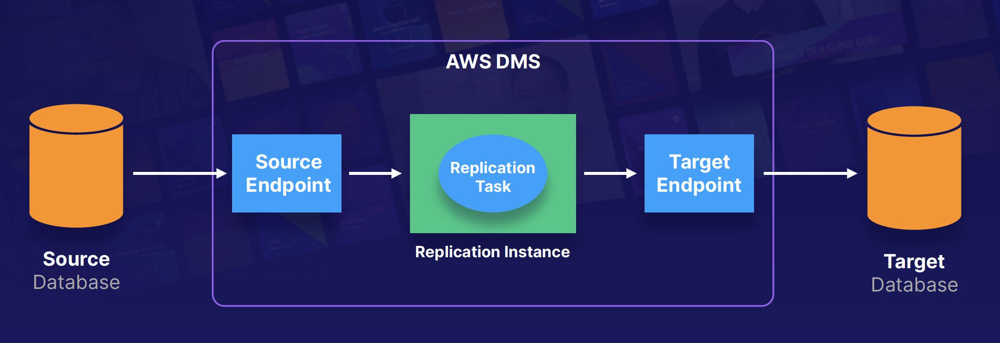

## Database Migration Service

AWS Database Migration Service (DMS) is a cloud service that makes it easy to migrate relational databases, data warehouses, NoSQL databases, and other types of data stores. You can use AWS DMS to migrate your data into the AWS Cloud, between on-premises instances (through an AWS Cloud setup), or between combinations of cloud and on-premises setups.

### How Does DMS Work
At its most basic level, AWS DMS is a server in the AWS Cloud that runs replication software. You create a source and target connection to tell AWS DMS where to extract from and load to. Then you schedule a task that runs on this server to move your data. AWS DMS creates the tables and associated primary keys if they don't exist on the target. You can pre-create the target tables manually, or you can use AWS Schema Conversion Tool (SCT) to create some or all of the target tables, indexes, views, triggers, etc.

### Types of DMS Migrations
- **Homogenous migrations**: same DB Engine like Oracle -> Oracle
- **Heterogeneous migrations**: different DB Engine like SQL Server -> Amazon Aurora

### Sources & Targets
- Sources:
  - On-premises and EC2 instances databases: Oracle, Microsoft SQL Server, MySQL, MariaDB, PostgreSQL, SAP, MongoDB, Db2
  - Azure SQL Database
  - Amazon RDS (including Aurora)
  - Amazon S3
- Target:
  - On-premises and EC2 instances databases: Oracle, Microsoft SQL Server, MySQL, MariaDB, PostgreSQL, SAP 
  - RDS
  - Redshift
  - DynamoDB
  - S3
  - Elasticsearch service
  - Kinesis Data Streams
  - DocumentDB

### DMS in Action:
Solution Overview of DMS: 

On-Premises Database <-------> EC2 Instance (Running DMS) -------> RDS

AWS Schema Conversion Tool: You do not need SCT if you are migrating to identical databases!

On-Premises Database <-------> EC2 Instance (Running DMS and SCT) -------> RDS

### Exam Tips:
Remember the following:
- DMS allows you to migrate databases from one source to AWS.
- The source can either be on-premises, or inside AWS itself or another cloud provider such as Azure.
- You can do homogenous migrations (same DB engines) or heterogeneous migrations.
- If you do a heterogeneous migration, you will need the AWS Schema Conversion Tool (SCT).