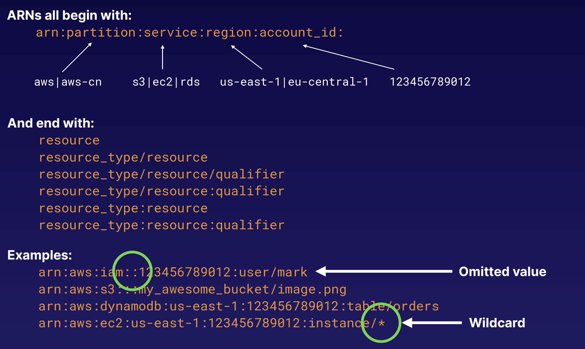
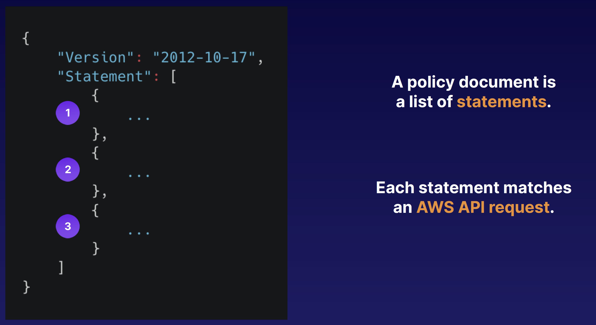
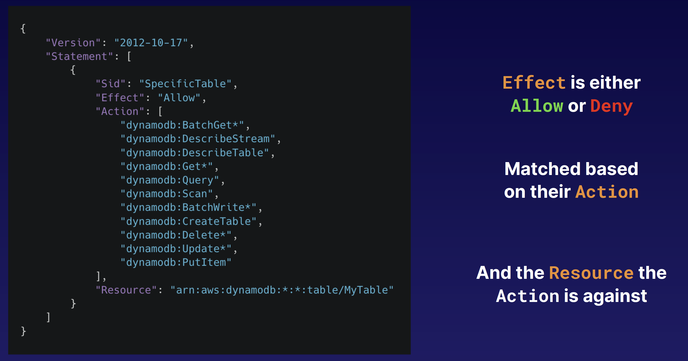

## IAM Policies

### Amazon Resource Name (ARN)

### IAM Policies
- JSON document that defines permissions
- Identity policy
- Resource policy
- No effect until attached
- List of statements

### Evaluating IAM Policies
- Not explicitly allowed == implicitly denied
- Explicit deny > everything else
- Only attached policies have effect
- AWS joins all applicable policies
- AWS-managed vs. customer-managed

### Permission Boundaries
- Used to delegate administration to other users
- Prevent privilege escalation or unnecessarily broad permissions
- Control maximum permissions an IAM policy can grant
- Use cases:
  - Developers creating roles for Lambda functions
  - Application owners creating roles for EC2 instances
  - Admins creating ad hoc users
