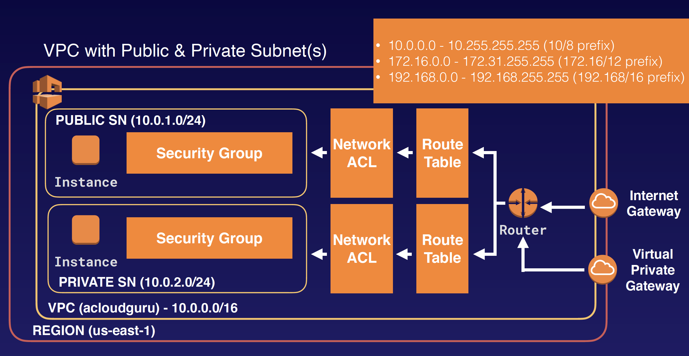

## VPC Overview

### What is a VPC
Amazon Virtual Private Cloud (Amazon VPC) lets you provision a logically isolated section of the Amazon Web Services (AWS) Cloud where you can launch AWS resources in a virtual network that you define. You have complete control over your virtual networking environment, including selection of your own IP address range, creation of subnets, and configuration of route tables and network gateways.

You can easily customize the network configuration for your Amazon Virtual Private Cloud. For example, you can create a public-facing subnet for your webservers that has access to the Internet, and place your backend systems such as databases or application servers in a private-facing subnet with no Internet access. You can leverage multiple layers of security, including security groups and network access control lists, to help control access to Amazon EC2 instances in each subnet.

Additionally, you can create a Hardware Virtual Private Network (VPN) connection between your corporate datacenter and your VPC and leverage the AWS cloud as an extension of your corporate datacenter.

### What can we do with a VPC?
- Launch instances into a subnet of your choosing
- Assign custom IP address ranges in each subnet
- Configure route tables between subnets
- Create internet gateway and attach it to our VPC
- Much better security control over your AWS resources
- Instance security groups
- Subnet network access control lists (ACLS)

### Default VPC vs Custom VPC
- Default VPC is user friendly, allowing you to immediately deploy instances.
- All Subnets in default VPC have a route out to the internet.
- Each EC2 instance has both a public and private IP address.

### VPC Peering
- Allows you to connect one VPC with another via a direct network route using private IP addresses.
- Instances behave as if they were on the same private network
- You can peer VPC's with other AWS accounts as well as with other VPCs in the same account.
- Peering is in a star configuration: ie 1 central VPC peers with 4 others. NO TRANSITIVE PEERING!!! (cannot access to other VPC THROUGH another VPC)
- You can peer between regions.

### Exam Tips
Remember the following;
- Think of a VPC as a logical datacenter in AWS.
- Consists of IGWs (Or Virtual Private Gateways), Route Tables, Network Access Control Lists, Subnets, and Security Groups
- 1 Subnet = 1 Availability Zone
- Security Groups are Stateful; Network Access Control Lists are Stateless
- NO TRANSITIVE PEERING
- When you create a VPC a default Route Table, Network Access Control List (NACL) and a default Security Group.
- It won't create any subnets, nor will it create a default internet gateway.
- US-East-1A in your AWS account can be a completely different availability zone to US-East-1A in another AWS account. The AZ’s are randomized.
- Amazon always reserve 5 IP addresses within your subnets.
- You can only have 1 Internet Gateway per VPC.
- Security Groups can't span VPCs.
