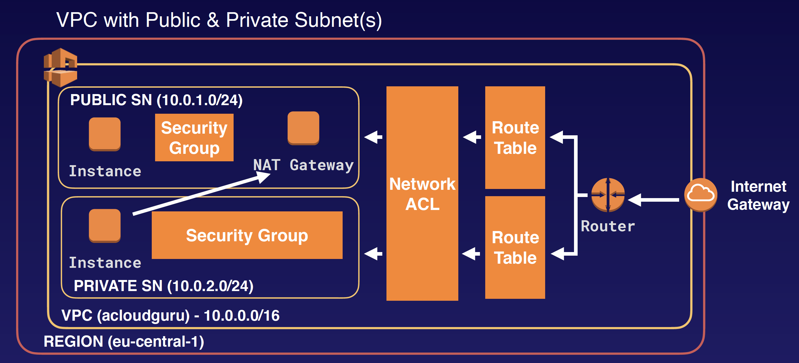

## NAT Instance and NAT Gateway

NAT Instances 
- When creating a NAT instance, Disable Source/Destination Check on the Instance.
- NAT instances must be in a public subnet.
- There must be a route out of the private subnet to the NAT instance, in order for this to work.
- The amount of traffic that NAT instances can support depends on the instance size. If you are bottlenecking, increase the instance size.
- You can create high availability using Autoscaling Groups, multiple subnets in different AZs, and a script to automate failover.
- Behind a Security Group.

NAT Gateways
- Redundant inside the Availability Zone
- Preferred by the enterprise
- Starts at 5Gbps and scales currently to 45Gbps
- No need to patch
- Not associated with security groups
- Automatically assigned a public ip address
- Remember to update your route tables.
- No need to disable Source/Destination Checks
- If you have resources in multiple Availability Zones and they share one NAT gateway, in the event that the NAT gateway’s Availability Zone is down, resources in the other Availability Zones lose internet access. To create an Availability Zone-independent architecture, create a NAT gateway in each Availability Zone and configure your routing to ensure that resources use the NAT gateway in the same Availability Zone.