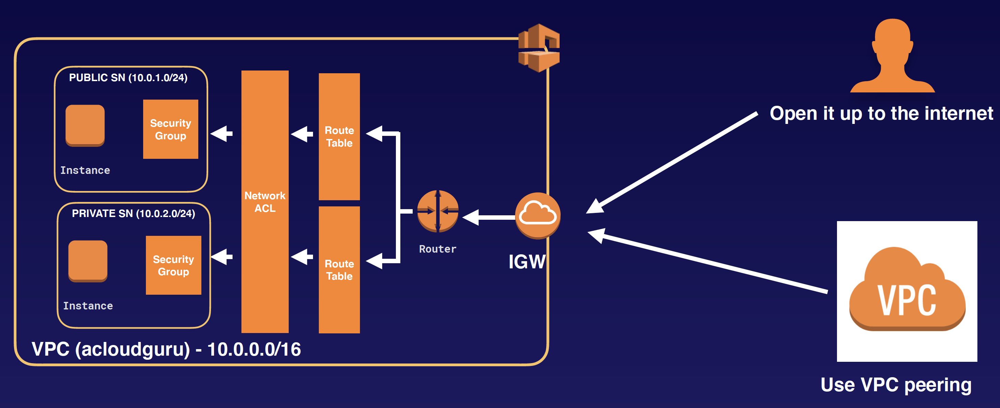
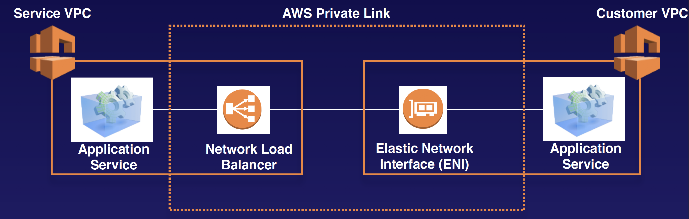

## AWS Private Link

### Opening Your Services in a VPC to Another VPC

To open our applications up to other VPCs, we can either:
Open the VPC up to the internet:
- Security considerations; everything in the public subnet is public.
- A lot more to manage.

Use VPC peering:
- You will have to create and manage many different peering relationships.
- The whole network will be accessible. This isn’t good if you have multiple applications within your VPC.

-> Use PrivateLink
- The best way to expose a service VPC to tens, hundreds, or thousands of customer VPCs 
- Doesn’t require VPC peering; no route tables, NAT, IGWs, etc.
- Requires a Network Load Balancer on the service VPC and an ENI on the customer VPC

AWS PrivateLink
- If you see a question asking about peering VPCs to tens, hundreds, or thousands of customer VPCS, think of AWS PrivateLink.
- Doesn’t require VPC peering; no route tables, NAT, IGWs, etc.
- Requires a Network Load Balancer on the service VPC and an ENI on the customer VPC
