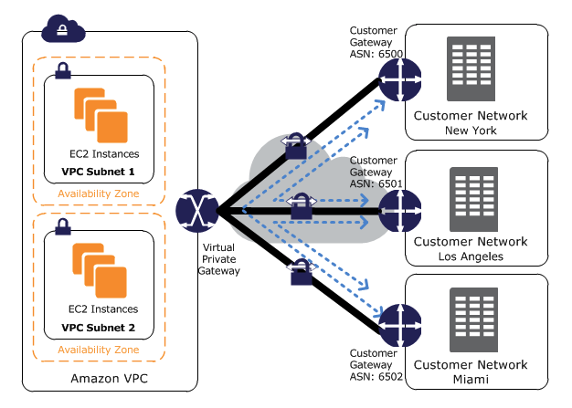

## AWS VPN Cloudhub

AWS VPN CloudHub
- If you have multiple sites, each with its own VPN connection, you can use AWS VPN CloudHub to connect those sites together.
- Hub-and-spoke model.
- Low cost; easy to manage.
- It operates over the public internet, but all traffic between the customer gateway and the AWS VPN CloudHub is encrypted.