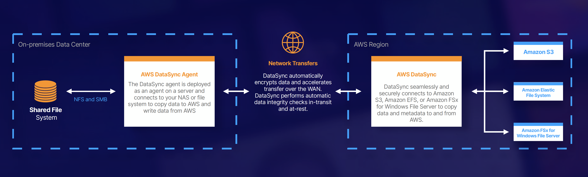

## AWS DataSync

### Exam Tips
- Used to move large amounts of data from on-premises to AWS.
- Used with NFS and SMB-compatible filesystems.
- Replication can be done hourly, daily, or weekly.
- Install the DataSync agent to start the replication.
- Can be used to replicate EFS to EFS.
