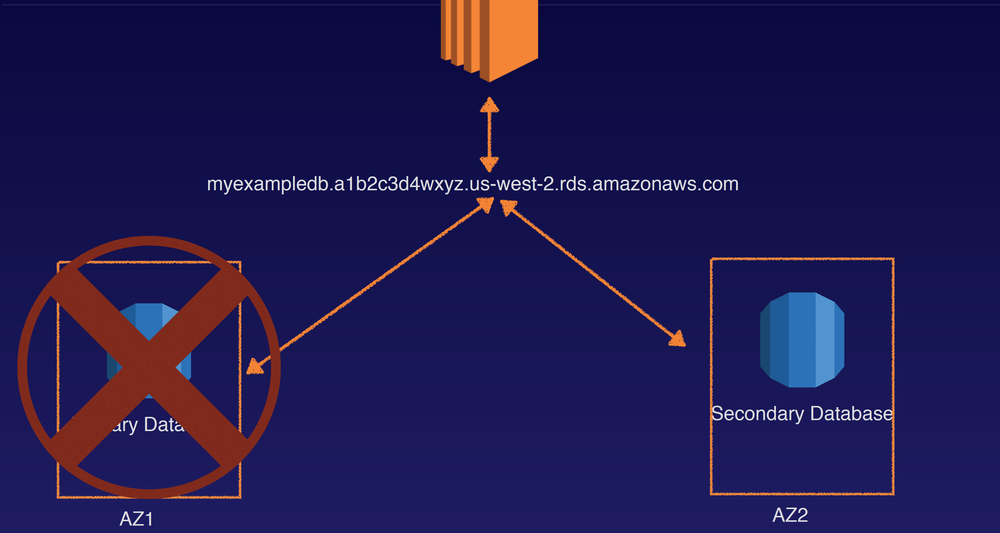
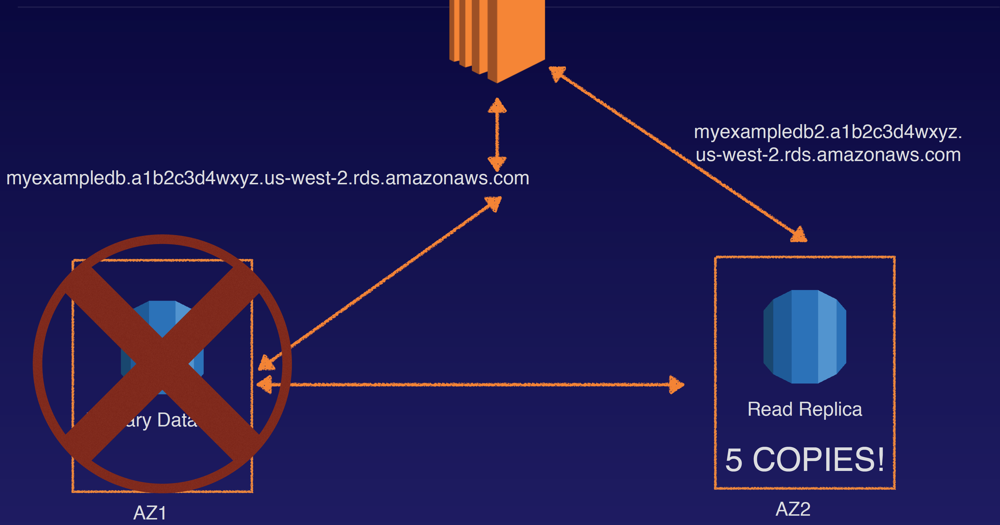

## Databases 101

### What is a relational database
Relational databases are what most of us are all used to. They have been around since the 70’s. Think of a traditional spreadsheet:
- Database
- Tables
- Row
- Fields (Columns)

### Relational databases on AWS;
- SQL Server
- Oracle
- MySQL Server
- PostgreSQL
- Aurora
- MariaDB

### RDS has two key features;
- Multi-AZ - For Disaster Recovery

- Read Replicas - For Performance

### Non Relational Databases
Non Relational Databases are as follows:
- Collection = Table
- Document = Row
- Key Value Pairs = Fields

### What is Data Warehousing
- Used for business intelligence. Tools like Cognos, Jaspersoft, SQL Server Reporting Services, Oracle Hyperion, SAP NetWeaver.
- Used to pull in very large and complex data sets. Usually used by management to do queries on data (such as current performance vs targets etc)

### OLTP vs OLAP
Online Transaction Processing (OLTP) differs from OLAP Online Analytics Processing (OLAP) in terms of the types of queries you will run.

- OLTP Example: Order number 2120121
  - Pulls up a row of data such as Name, Date, Address to Deliver to, Delivery Status etc.
- OLAP transaction Example: Net Profit for EMEA and Pacific for the Digital Radio Product. Pulls in large numbers of records:
  - Sum of Radios Sold in EMEA
  - Sum of Radios Sold in Pacific
  - Unit Cost of Radio in each region
  - Sales price of each radio
  - Sales price - unit cost.

Data Warehousing databases use different type of architecture both from a database perspective and infrastructure layer. Amazon’s Data Warehouse Solution Is Called Redshift

### What Is ElastiCache
ElastiCache is a web service that makes it easy to deploy, operate, and scale an in-memory cache in the cloud. The service improves the performance of web applications by allowing you to retrieve information from fast, managed, in-memory caches, instead of relying entirely on slower disk-based databases.

ElastiCache supports two open-source in-memory caching engines:
- Memcached
- Redis

### Exam Tips
- RDS (OLTP)
  - SQL
  - MySQL
  - PostgreSQL
  - Oracle
  - Aurora
  - MariaDB
- DynamoDB (No SQL)
- Red Shift (OLAP) for Business Intelligence or Data Warehousing
- Elasticache speed up performance of existing databases (frequent identical queries).
  - Memcached
  - Redis
- Remember the following points:
  - RDS runs on virtual machines
  - You cannot log in to these operating systems however.
  - Patching of the RDS Operating System and DB is Amazon’s responsibility
  - RDS is NOT Serverless
  - Aurora Serverless IS Serverless
  