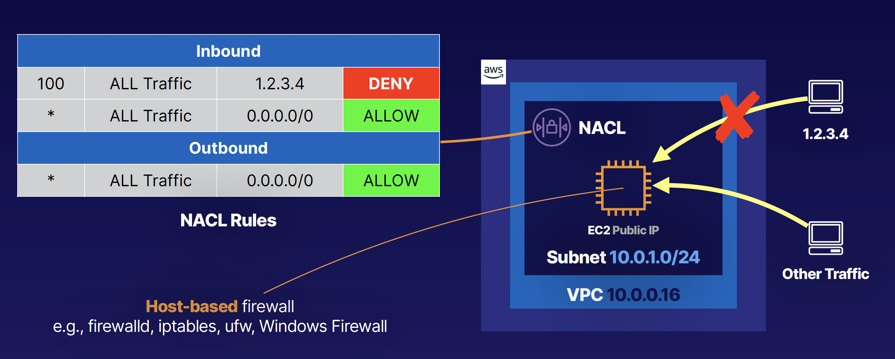
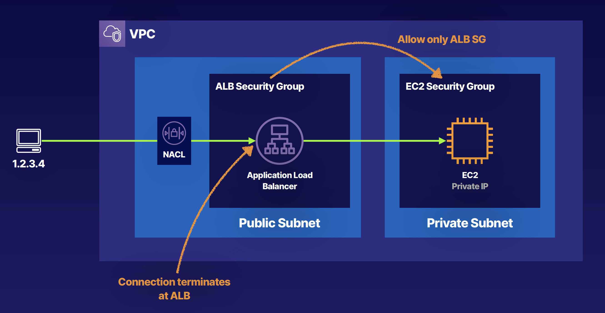
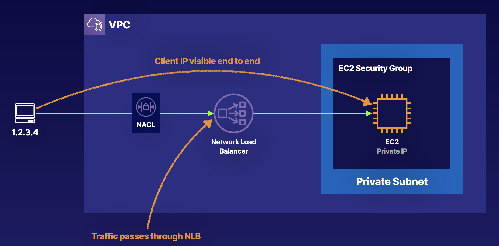
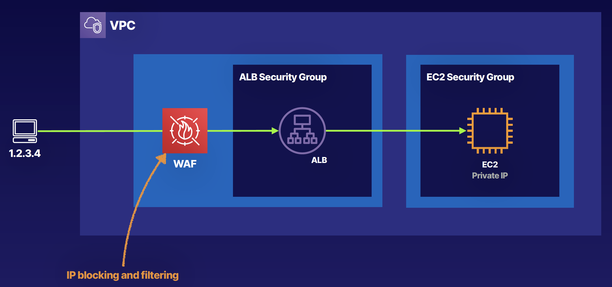
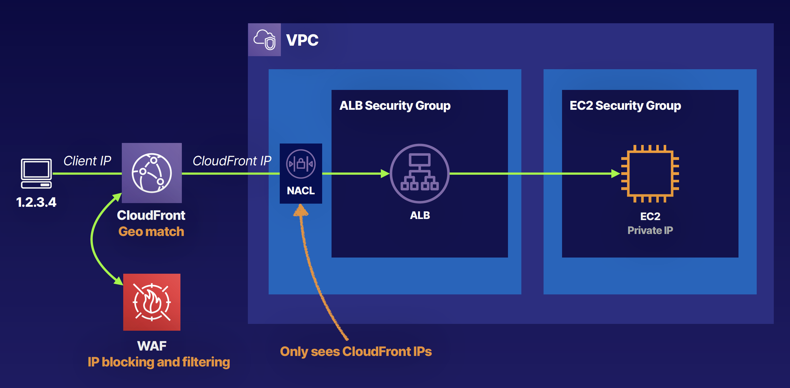

## Reducing Security Threats

### Bad Actors
- Typically automated processes
- Content scrapers
- Bad bots
- Fake user agent
- Denial of service (DoS)

### Benefits of Preventing Bad Actors
- Reduce security threats
- Lower overall costs

### Network Access Control List

### Application Load Balancer

### Network Load Balancer

### Web Application Firewall

### WAF + Cloudfront
NACL is useless
